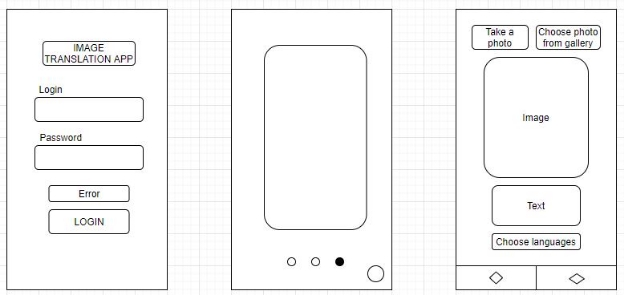
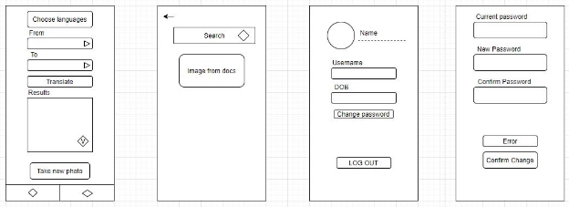
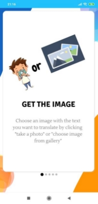

**IMAGE TRANSLATION APP USING GOOGLE ML KITS**

1. **INTRODUCTION:**

   This application is created for extracting text from images, identifying the current languages, then translating it to any languages supported by Google. It also supports many functions to help users to use this app more easily and comfortably. (sign in, sign up, text to speech,...).

2. **OVERVIEW:**

   In this project, we create an environment to support users when they meet difficulty in understanding the meaning of some paragraphs because it is not written in their native languages.

   Therefore, our application will support users to input a photo from their camera or from the storage of their device. Our app will recognize the text and its current language in that image and then the users can choose the language they want to translate into. Our app will translate the meaning of the text into the chosen language.

   We have created many functionalities to support users, such as, let users create their own accounts, slide to guild users how to use this app, recognize the language from the text of images, and support voice reading results after translating.

3. **TECHNIQUES:**
- **Mock API:** building a simple server providing **REST API** which helps to grant users’ credentials.
- **Firebase ML Vision kits:** SDK of Google providing a tool for receiving images and returning the text which is detected from the images.
- **Firebase Translate API:** API receives data as a string of text and returns translated text.
- **Firebase Identify Languages:** API receives data as a string of text and returns the language of this string.
- **Text to speech:** Built-in TextToSpeech function.
- **AsyncTask:** Create a new thread to call API which helps to reduce work on the main thread.
- **Volley:** This library helps to interact with API where we make requests to query data from the server.
- **Intent:** Using custom intent to manipulate data between activities.

**APP STRUCTURE:**
1. **Draft design:**

2. **Describe logic:**

**Screen 1+2:** Call request to mock API via Volley library to sign in to the application. This app also allows new users who don’t have an account to create a new one to use. 
![ref1]![ref2]

**Screen 3:** Create sliders to guide users step by step to understand how to use our application.

There are **2 tabs** of this application which are the **main app flow (Screen 4)** and the **profile feature (Screen 5)**:

***Main flow:***

**Screen 4.1:** 

Choose a method to take the photo to determine the text to translate and view your own image in this tab (image can be available or take the new one). 
![ref3]

**Screen 4.2, 4.3:** Recognizing the language from the text of users’ images and let them choose the language they want to translate that text into. Users can also listen to the translated text by clicking on the volume symbol at the bottom right corner of the screen.
![ref5]![ref6]

***Profile flow:***

**Screen 5.1:** This screen shows the user’s profile including personal information as registering and some functions to change their info.
![ref4]

**Screen 5.2:** Support changing users’ passwords
![ref8]

**Demo:** This is an example of recognizing the text from an image. 
![ref9]![ref10]

[ref1]: ./assets/Aspose.Words.9de52055-7bf6-4e7d-815e-6661bf7a1a53.003.jpeg
[ref2]: ./assets/Aspose.Words.9de52055-7bf6-4e7d-815e-6661bf7a1a53.004.jpeg
[ref3]: ./assets/Aspose.Words.9de52055-7bf6-4e7d-815e-6661bf7a1a53.006.jpeg
[ref4]: ./assets/Aspose.Words.9de52055-7bf6-4e7d-815e-6661bf7a1a53.009.jpeg
[ref5]: ./assets/Aspose.Words.9de52055-7bf6-4e7d-815e-6661bf7a1a53.007.jpeg
[ref6]: ./assets/Aspose.Words.9de52055-7bf6-4e7d-815e-6661bf7a1a53.008.jpeg

[ref7]: ./assets/Aspose.Words.9de52055-7bf6-4e7d-815e-6661bf7a1a53.008.jpeg
[ref8]: ./assets/Aspose.Words.9de52055-7bf6-4e7d-815e-6661bf7a1a53.010.jpeg
[ref9]: ./assets/Aspose.Words.9de52055-7bf6-4e7d-815e-6661bf7a1a53.011.jpeg
[ref10]: ./assets/Aspose.Words.9de52055-7bf6-4e7d-815e-6661bf7a1a53.012.jpeg